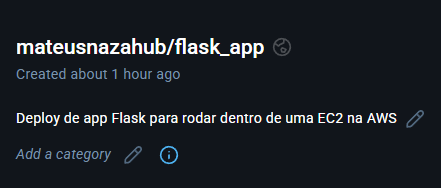

# Desenvolvedor-Python-Jr

# Índice
    
[Preparação de ambiente](#preparação-de-ambiente)    
1. [Machine Learning](#1-machine-learning)
   - [Questão](#questão)
   - [Resposta](#resposta)
2. [Data Analysis](#2-data-analysis)
   - [Detalhes do código](#detalhes-do-código)
   - [Como executar o código](#como-executar-o-código)
3. [Web Framework](#3-web-framework)
   - [Detalhes do código](#detalhes-do-código-1)
   - [Como executar o app](#execução-do-app)
4. [Asynchronous Programming](#4-asynchronous-programming)
   - [Detalhes do código](#detalhes-do-código-2)
   - [Como executar o código](#como-executar-o-código-1)
5. [Cloud Services](#5-Cloud-Services)
   - [#Resposta à questão](#resposta-à-questão)
6. [Containerization](#6-containerization)
   - [Detalhes do Desenvolvimento](#detalhes-do-desenvolvimento)
   - [Como executar o código](#como-executar-o-código-2)
7. [Security Practices](#7-security-practices)
   - [Erros notados](#erros-notados)
   - [Solução proposta](#solução-proposta)

---
# Preparação de ambiente       
    
Para preparar o ambiente escolhi por usar o ambiente virtual do python (venv), sendo assim, consigo ter um ambiente de desenvolvimento desacoplado para instalar as dependências necessárias. Abaixo seguem comandos que efeutei no terminal para preparar esse ambiente:    
    
```bash
# Detalhe importante!! Criei esse ambiente na pasta raiz do repositório
# Cria um novo ambiente venv dentro de uma pasta chamada ".venv"
python -m venv .venv

# Inicia o ambiente
source .venv/bin/activate

# Instala as bibliotecas necessárias
pip install flask pandas asyncio

# Cria um arquivo requirements.txt com todas as bibliotecas e dependências que tenho instaladas no meu ambiente
pip freeze > requirements.txt
```
    
# 1. Machine Learning
    
## Questão
    
Explique com suas palavras qual seria o impacto de um dataset desbalanceado em um modelo de classificação e proponha uma solução para mitigar esse problema.
    
## Resposta
    
- Em modelo desbalanceado as classes não estão sendo representadas de forma equilibrada e isso pode gerar resultados enviesados. Por exemplo, imagine um modelo que prevê doenças no coração e o dataset contém muito mais dados de mulheres do que de homens. Nesse caso, o modelo pode se tornar tendencioso e apresentar resultados mais fortes para as mulheres, enquanto pode não ser tão preciso para os homens.
    
- Para corrigir podemos seguir duas abordagens:
   - Undersampling (Subamostragem): retirar uma amostra menor de dados de mulheres para que fique equivalente à quantidade de dados de homens.
   - Oversampling (Superamostragem): podemos buscar enriquecer a fonte com mais dados de homens, seja buscando de outras fontes ou criando novos exemplos sintéticos a partir dos originais.
    
# 2. Data Analysis
    
## Detalhes do código    
    
Para efetuar as análises nos dados de venda eu utilizei a biblioteca pandas e segui os seguintes passos:    
    
- Criei meu arquivo '.csv' com dados de vendas de produtos hospitalares, seguindo a estrutura de colunas proposta no exercício.    
- Li o arquivo de vendas e salvei dentro de um _Dataframe_ chamado 'vendas'.    
- Criei uma nova coluna 'total' que basicamente multiplica a 'quantidade' pelo 'valor_unitario'.    
- Calculei o faturamento por produto agrupando o _Dataframe_ por produto e somando os valores da coluna 'total'.    
- Para encontrar o produto de maior e menor faturamento eu utilizei respectivamente as funções _idxmax_ e _idxmin_, juntamente com a função _loc_.    
    
## Como executar o código    
    
1. Estando na pasta raiz do repositório, instale as dependências: ```bash pip install -r requirements ```
2. Acesse a pasta '2. Data Analysis' atravéz do comando: ```bash cd 2.\ Data\ Analysis/```
3. Execute o script: ```bash python main.py ```
    

# 3. Web Framework    
         
## Detalhes do código       
     
No código eu sigo as seguintes estapas:    
    
- Importo de dentro da biblioteca flask classes e funções que utilizarei
- Inicio o meu app Flask
- Defino o primeiro Endpoint 'GET'
- Abixo do decorador crio uma função que retorna uma mensagem de saudação personalizada com o nome utilizado na URL
- Defino o segundo endpoint 'POST' e logo abaixo crio a função soma()
- Chamo a função de inicialização do meu app
    

## Execução do app

Para executar o app deve se seguir os seguintes passos:
    
1. Estando na pasta raiz do repositório, instale as dependências: ```bash pip install -r requirements ```
2. Acesse a pasta '3. Web Framework' atravéz do comando: ```bash cd 3.\ Web\ Frameworks/```
3. Inicie o app: ```bash python app.py ```
    
    
Agora você está com o app rodando na porta 5000, para acessá-lo atravéz da requisição GET basta:    
    
1. Colar essa URL em um navegador web, substituindo 'SeuNome' pelo seu nome: http://127.0.0.1:5000/saudacao?nome=SeuNome    
    
    
Já para a requisição POST, podemos acessar via POSTMAN, cURL, mas nesse projeto achei melhor criar um código python utilizando da biblioteca requests. Para efetuá-la:
    
1. Abra o arquivo nums_para_somar.py e substitua os números por os que você deseja somar (Opcional)
2. Abra um novo terminal, e, caso não esteja na pasta '3. Web Framework', acesse atravéz do comando: ```bash cd 3.\ Web\ Frameworks/```
3. Execute o Script de requisição: ```bash python requisicao_post.py ```
4. O resultado deve aparecer logo em seguida no terminal.
    

# 4. Asynchronous Programming
     
## Detalhes do código    
    
Para essa atividade utilizei a biblioteza _asyncio_ do python, criei uma função sincrona e uma assíncrona para verificar a diferença de performance. Abaixo segue o passo a passo:
    
- Criei uma função de chamada síncrona que utiliza o modulo _sleep_ da biblioteca _time_
- Para executar as três funões de chamada e medir o tempo de execução utilizei uma função *main_sync*
- Criei uma função assíncrona que utiliza o modulo _sleep_ porém dessa vez da biblioteca _asyncio_
- Para executar a função assíncrona três vezes e medir o tempo utilizei a função *main_async*
- Simulei uma das funções gastando 2 segundos de tempo de execução e as outras duas gastando 1 segundo de execução, fiz isso para os dois cenários.
    
>**Resultado:**    
>As funções síncronas levaram **4 segundos** para executar
>Já as funções assíncronas foram **2 segundos** de execução
>Ou seja, o tempo de execução caiu pela metade quando usamos as funções assíncronas
    
## Como executar o código    
    
1. Estando na pasta raiz do repositório, instale as dependências: ```bash pip install -r requirements ```
2. Acesse a pasta '4.\ Asynchronous\ Programming' atravéz do comando: ```bash cd 4.\ Asynchronous\ Programming```
3. Execute o script: ```bash python main.py ```
        

# 5. Cloud Services  
       
## Resposta à questão
       
Com minha aplicação containerizada dentro de uma imagem, poderia seguir por dois caminhos:
      
- Registrar ela no Amazon ECR
- Registrar ela no Docker Hub
      
Nesse projeto optei por subir ela no **Docker Hub**, assim como citei no **Exercício 6**.
      
Dentro do console AWS, inicio os seguintes passos:
         
1. Criei um _key pair_ do tipo RSA para permitir acesso seguro à instância via SSH.
2. Criei um _Security Group_ bem restrito.
3. Criei uma instância padrão do EC2 do tipo t2.micro e utilizei o _key pair_ e _security group_ anteriores.
      
Com a instância criada, realizei o acesso via terminal e efetuei os seguintes comandos:
     
```bash
# Atualiza a lista de pacotes
sudo yum update -y

# Instala o Docker
sudo yum install docker -y

# Inicia a engine do Docker
sudo service docker start

# Adiciona o usuário atual ao Docker para permitir 
# execuções sem precisar do comando 'sudo' no início
sudo usermod -a -G docker ec2-user

# Faz login no Docker Hub
docker login

# Faz o pull da minha imagem
docker pull mateusnazahub/flask_app:latest

# Verifica a lista de imagens para ver se veio certinho
docker images

# Inicia um container a partir da minha imagem
docker run -d --rm -p 5000:5000 mateusnazahub/flask_app
```
    
Pronto, após esses passos a API já está rodando dentro da EC2 e está disponível dentro do link abaixo, lembre-se de substituir DigiteSeuNome pelo seu nome.
    
http://ec2-54-86-100-78.compute-1.amazonaws.com:5000/saudacao?nome=DigiteSeuNome   
    

# 6. Containerization    
     
## Detalhes do desenvolvimento
     
Para containerizar minha aplicação, criei uma imagem _docker_ que reproduz meu ambiente de execução local dentro de um container. Após construir o _Dockerfile_ executei os seguintes passos:
     
1. Construí minha imagem: ```bash docker build -t app_flask .```
2. Verifiquei os dados dela: ```bash docker images```
3. Rodei um container para testar se estava funcionando como deveria: ```bash docker run -d --rm -p 5000:5000 app_flask```
       
>Resolvi também subir essa imagem para o Docker Hub, poise assim facilita o Deploy posteriormente.
     
4. Fiz o login no Docker Hub: ```bash docker login```
5. Em paralelo, criei um novo repositório no _Docker Hub_ 
5. 'Tagueei' minha imagem: ```bash tag app_flask mateusnazahub/flask_app:latest```
6. Subi ela para o _Docker Hub_: ```bash push mateusnazahub/flask_app:latest```
     
## Como executar o código 
     
1. Acesse a pasta '6. Containerization' atravéz do comando: ```bash cd 6.\ Containerization```
2. Construa a imagem: ```bash docker build -t app_flask .```
3. Inicie um container a partir da imagem criada: ```bash docker run -d --rm -p 5000:5000 app_flask```

A partir desse momento o app estará rodando na porta 5000 do localhost, para acessá-lo basta:

1. Colar essa URL em um navegador web, substituindo 'SeuNome' pelo seu nome: http://127.0.0.1:5000/saudacao?nome=SeuNome
    
    
# 7. Security Practices 
    
## Erros notados
    
1. Não possui nenhum banco de dados para armazenar os dados de login, da forma como está o código teria que fazer um if para cada usuário, o que seria extremamente inviável e não seguro.
2. Não possui nenhuma função hash para a senha, o que deixa a senha exposta no código.
       
## Solução proposta
      
1. Implementar um banco de dados para armazenamento de dados de usuário. Também precisará criar uma função para cadastrar novos usuários dentro do banco de dados.
2. Utilizar uma função de hash que codifica a senha.


